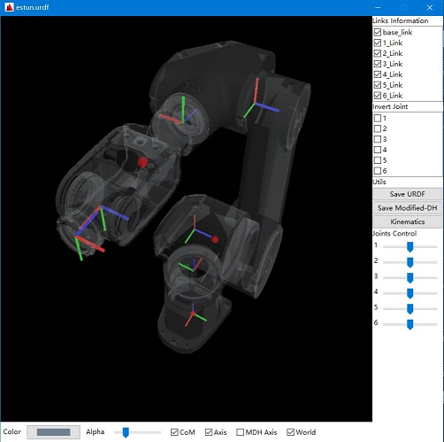

# RoboticsInOne
Robotics In One (RIO) Studio

[Chinese README](./README_CH.md)
## Introduction
RIO is committed to providing a standard and complete tool chain and ecology with a graphical operation interface for the robot community. RIO implements 3D visualization of robot links, joints and center of mass (CoM) by specifying a URDF file, and generates kinematics/dynamics codes via URDF ->MDH ->Kinematics ->Jacobian ->Dynamics.

## Features
1. URDF file visualization, including Link (adjustable transparency), Axis, CoM, etc
2. Joints Control
3. Invert Joint Z-Axis: z axis of any joint can be manually adjusted to achieve joint configuration consistent with the real robot
4. Exporting modified D-H parameters
5. Kinematics: forward kinematics, Jacobian symbolic representation, and code generation
6. Dynamics: mass matrix M, symbolic representation of Inverse Dynamics and code generation
7. Verification code generation with one single click: randomly generate test samples so that users can verify the correctness by comparing the results of the generated codes with the numerical solution provided by pybullet.
## TODO
* Interface: symoro is currently used for rigid body dynamics derivation; The code verification process currently utilizes pybullet. In the future, we hope to provide more interfaces and leave enough room for extensions. We believe it would be owesome if users are allowed to write their own plugins to connect to any rigid body dynamics library.
* Code generation: derive the minimum parameter set, generate C++ and Python codes for system identification; randomly generate test samples and calculate results
* A series of tutorials (including websites, videos, blogs) should be produced.

## Remark
1. URDF Joints Axis should be [0, 0, 1]
2. The urdf file contains only revolute joints
3. Currently, only URDF code generation with 1 subtree is supported

## Contact us
RoboticsInOne QQ Chat Group：179412348
