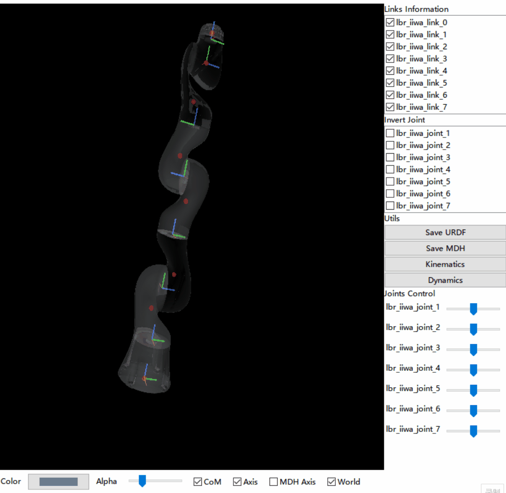

# RoboticsInOne
Robotics In One (RIO) Studio
## 介绍
RIO致力于为机器人社区提供标准且完备的工具链与生态，并提供图形化操作界面。RIO通过打开URDF文件，实现机器人Link、Joint以及Center of Mass (CoM) 的3D可视化，并实现了URDF->MDH->Kinematics->Jacobian->Dynamics的机器人运动学、动力学链路式转换与代码生成。RIO为了更好地实现URDF文件与现实机器人之间的对应，首次提供了一键式Joint Z-Axis Invert功能，从而实现关节转动方向的一致性，大幅度避免系统辨识、控制器设计上繁琐的正负号调整。RIO提供了运动学以及动力学的符号表达以及python/c++代码生成，从而具有更加广泛的应用前景。


## 安装
* 对于Windows用户可以
  * 直接下载release版本，双击bat文件即可运行；
  * 或者克隆源代码，配置环境后运行（通常会具有更多的功能）
    ```bash
    git clone https://github.com/yunlongdong/RoboticsInOne.git
    cd RoboticsInOne
    pip install -r requirements.txt
    python RIO.py
    ```

* 对于ubuntu用户，你首先需要根据[这个链接](https://wxpython.org/pages/downloads/index.html)安装wxPython，即
    ```bash
    # 注意把ubuntu-22.04替换为你自己的ubuntu版本
    pip install -U -f https://extras.wxpython.org/wxPython4/extras/linux/gtk3/ubuntu-22.04 wxPython
    ```

    然后，使用下面的命令安装其他python包 other packages
    ```bash
    git clone https://github.com/yunlongdong/RoboticsInOne.git
    cd RoboticsInOne
    # install other packages
    pip install matplotlib sympy plyfile numpy scipy pandas pyrr pybullet anytree
    # install moderngl
    pip install moderngl==5.5.4
    python RIO.py
    ```

## 问题解决
* 在ubuntu 16.04下，如果出现报错'error: GLSL 3.30 is not supported'，可以使用如下命令`export MESA_GL_VERSION_OVERRIDE=3.3`解决，之后直接运行`python RIO.py`即可。

## 功能
1. URDF文件可视化，包括Link（透明度可调）、Axis、CoM等
2. Joints可控制
3. 可以手动Invert Joint Z-Axis，即关节方向的调节，从而实现与真实Robot一致的关节配置
4. Modified D-H参数导出
5. 运动学：正运动学、Jacobian符号表达以及代码生成
6. 动力学：质量矩阵M、Inverse Dynamics符号表达以及代码生成
7. 系统辨识：最小参数集导出，系统辨识C++、Python代码生成
8. 一键生成验证代码：随机生成测试样例，生成代码与pybullet的数值解进行对比验证
## TODO
* 接口：刚体动力学推导目前使用了symoro；代码验证目前使用了pybullet。未来希望能提供更多的接口，并留出可扩展的余地，最好可以暴露一些接口允许用户自行编写插件连接到任意刚体动力学库。
* 搭建教程网站，以及系列视频和博客等
## 注意事项
1. URDF文件Joints的Axis应该按照规范制定为[0, 0, 1]
2. URDF文件只能包含旋转关节，其他关节暂不支持
3. 目前仅支持subtree数量为1的urdf代码生成
4. 浮基机器人暂不支持

## 交流
RoboticsInOne技术交流QQ群：179412348
